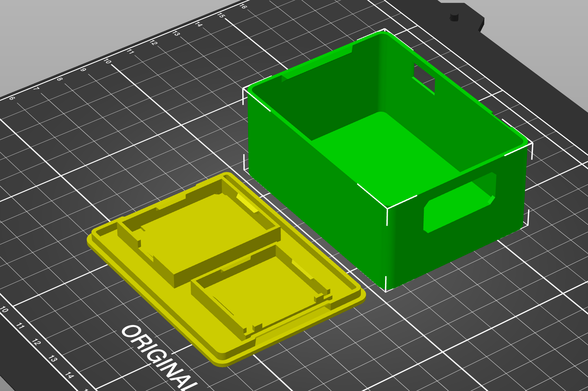
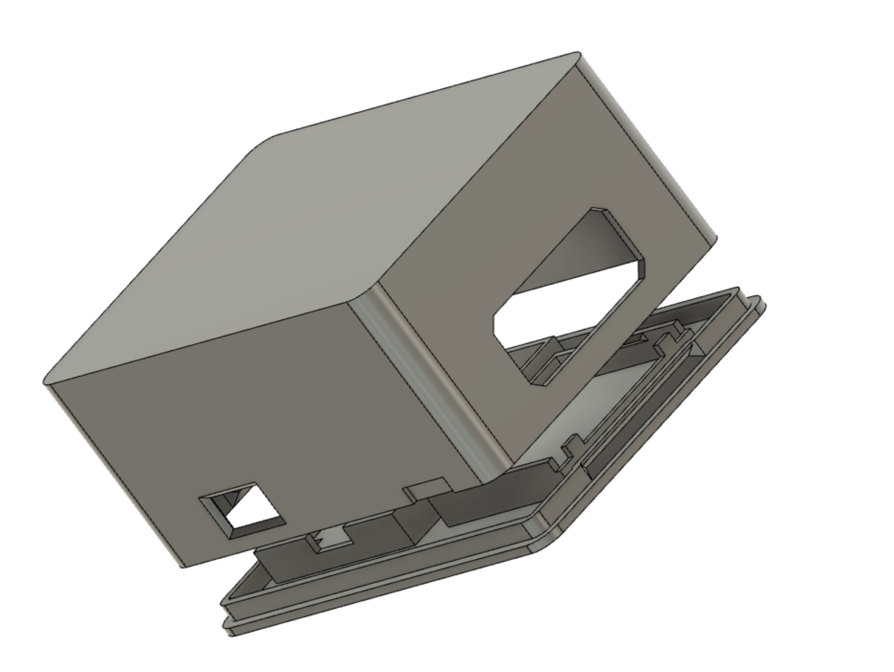
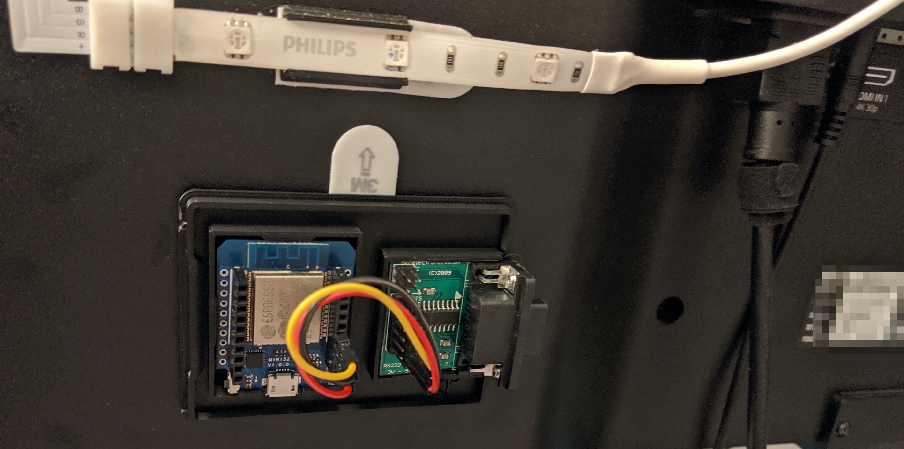
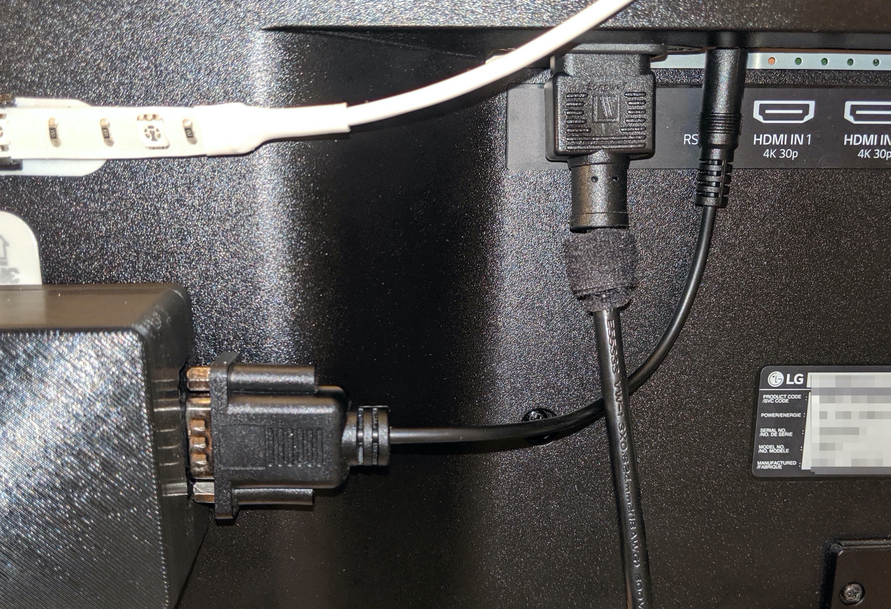
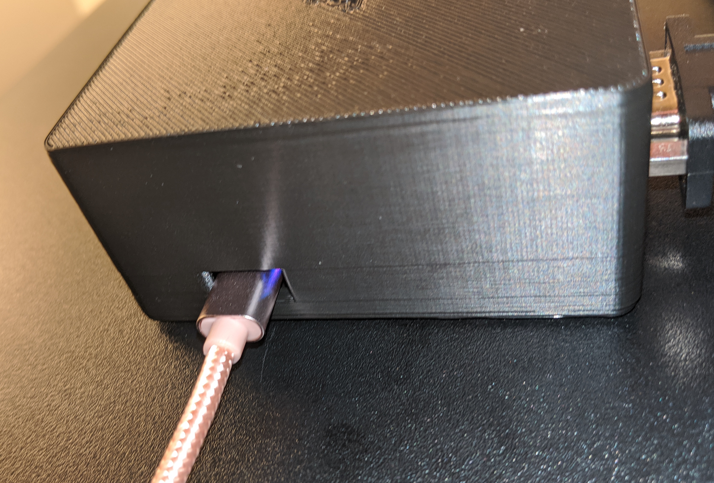

# LG 43UD79 to Home Assistant Bridge

My workstation monitor happens to have a UART for basic automation / control purposes. After some digging, I figured out how to send basic commands to the monitor and then created a small ESPHome powered device to allow me to control my monitor from Home Assistant.

The [`monitor-bridge.yaml`](./esphome/monitor-bridge.yaml) file is everything needed to get [ESPHome](https://esphome.io/) running on a [simple ESP32 module](https://www.aliexpress.com/item/32834344071.html). Combine with a [cheap RS232/ttl converter](https://www.amazon.com/gp/product/B005D5T292/) and put in crude [enclosure](./enclosure) and you're done!

I have stripped the useful [serial details](./docs/serial_details.md) out of the [manual](./docs/monitior-manual.ENG_US.pdf).

The enclosure can be printed out of any material, but PLA is what I used. Infill and supports are up to you and will depend on your slicer and printer.

I'm not super proud of it, but the Fusion360 file is [included](./enclosure/public-monitor-bridge-case.f3d) should you want to make any changes.

### Installing

It's just three wires:

- VCC
- GND
- espTX

I don't care about any response the monitor may transmit, so there's no need to connect the espRX pin.

I chose to use `UART2` on pins `16/17`. See the `monitor_bridge.yaml` file for more details.

Mounted to the back of the monitor, it looks like this:

Wired up to the monitor, it looks like this:

And there's a small hole on the side of the enclosure for a USB cable:

The USB cable can be plugged into any USB power supply *or* a USB port. In the event that you have the drivers installed and the bridge is plugged into a USB port, you can view logs and upload new firmware directly over the cable.
